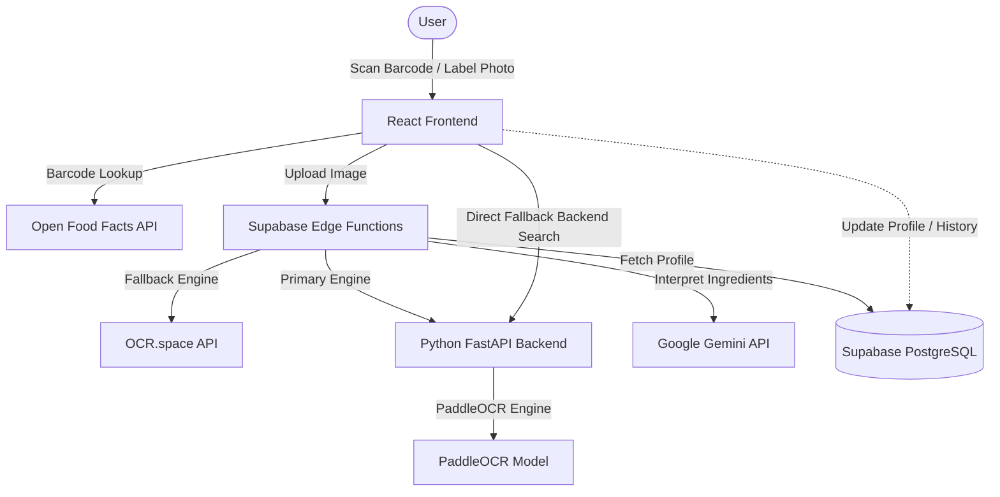

# 🔍 Label Insight Pro (NutriSense)

[](#)
[](LICENSE)
[](#)
[](#)
[](#)
[](#)

Personalized AI-powered food label understanding and OCR analyzer for healthier dietary choices at the moment of purchase.

---

## 📖 Introduction
**Label Insight Pro** (NutriSense) is a smart dietary assistant designed to help consumers decipher complex, cryptic food labels instantly. By combining optical character recognition (OCR) with advanced Large Language Models (LLMs), it analyzes ingredients against a user's specific health goals, age, medical conditions, and allergies. 

Whether you have diabetes, hypertension, celiac disease, or are simply trying to eat clean, Label Insight Pro provides critical clarity in the supermarket aisle, helping you avoid harmful ingredients and find healthier alternatives.

---

## 🏗️ System Architecture & Data Flow



1. **User Scanning:** The user captures a nutrition label image or scans a barcode using their mobile web browser.
2. **Dual Scanning Pipeline:**
   * **Barcode path:** Looks up details in the Open Food Facts (OFF) database. If not found or if data is incomplete, visual recognition triggers automatically.
   * **OCR path:** Processes the packaging image. The primary engine runs **PaddleOCR** on a Python FastAPI microservice. If unreachable, the system fails over to the **OCR.space API**.
3. **Reasoning & Enrichment:** The Deno Edge Function coordinates Gemini LLMs to structure OCR text, verify claims, check for hidden sugars/additives, and generate a tailored health report.
4. **Personalization:** Insights are cross-referenced directly with the user's Supabase profile (medical conditions, allergies, goals).

---

## ✨ Key Features
* 📷 **Dual OCR Engines:** Combines PaddleOCR (local, fast) and OCR.space (cloud fallback) for high-accuracy text extraction on curved, shiny, or crinkled packaging.
* 🛡️ **Allergen & Additive Red Flags:** Highlights hidden allergens (gluten, nuts, soy, dairy) and lists harmful chemical additives.
* 📊 **Proprietary Health Score:** Computes a 0–100 score based on nutritional parameters, processing level, and ingredient quality.
* 🥗 **Healthy Alternatives:** Recommends alternative products available in the database when a scanned item scores poorly.
* 🤖 **Dietary AI Chatbot:** Interactive health chat assistant to ask follow-up questions about scanned items.
* 🔄 **Graceful Degradation:** Multi-layered fallbacks ensure basic parsing is returned even during rate limits or server outages.

---

## 🛠️ Tech Stack
* **Frontend:** React, TypeScript, Vite, Tailwind CSS, shadcn/ui, Lucide React
* **Backend:** Python 3.11, FastAPI, Pydantic, RapidFuzz, PaddleOCR, PyTesseract, Pillow
* **Edge Layer:** Supabase Deno Edge Functions
* **Database & Auth:** Supabase (PostgreSQL, GoTrue Auth)
* **AI reasoning:** Google Gemini (Gemini Flash/Pro models)

---

## ⚙️ Environment Variables

A template `.env.example` is located in the root directory. To run this project, configure the following keys:

| Environment Variable | Description | Location | Required |
| :--- | :--- | :--- | :--- |
| `VITE_SUPABASE_URL` | Supabase Web client project connection URL | Frontend `.env` | Yes |
| `VITE_SUPABASE_ANON_KEY` | Supabase anonymous API key | Frontend `.env` | Yes |
| `VITE_BACKEND_URL` | Connection URL for FastAPI backend | Frontend `.env` | Yes |
| `SUPABASE_URL` | Supabase project URL | Backend `backend/.env` | Yes |
| `SUPABASE_ANON_KEY` | Supabase anonymous key | Backend `backend/.env` | Yes |
| `GEMINI_API_KEY` | Google Gemini API Key | Supabase Secrets | Yes |
| `OCR_SPACE_API_KEY` | Free key for OCR.space API fallbacks | Supabase Secrets | Optional (Fallback) |
| `PADDLE_OCR_URL` | PaddleOCR endpoint address | Supabase Secrets | Optional (Local) |

---

## 🗂️ Folder Structure Overview

```text
label-insight-pro/
├── .github/workflows/   # CI/CD deployment workflows
├── docs/
│   └── images/          # Documentation screenshots & images
├── src/                 # React Frontend
│   ├── components/
│   │   ├── common/      # App-wide shared components (Spinner, Navigation)
│   │   ├── layout/      # Layout components (MobileHeader)
│   │   ├── product/     # Product-specific cards, alerts, detailed modals
│   │   └── ui/          # Generic shadcn UI atomic elements
│   ├── config/          # Configurations & environment routers
│   ├── context/         # React Context providers (Auth, Settings)
│   ├── hooks/           # Custom React hooks (Barcode scanner, backend health)
│   ├── integrations/    # Supabase Client & Database types
│   ├── pages/           # View layouts (Home, History, Scanner, Results, Profile)
│   ├── services/        # Service modules (OCR, OFF, Recommendations, History)
│   └── utils/           # Utility functions (Local storage, audio cues)
├── backend/             # FastAPI OCR & data verification service
├── supabase/
│   ├── functions/       # Deno Edge functions (Gemini, suggestions, verify)
│   └── migrations/      # PostgreSQL Database schemas and table migrations
├── package.json         # Node scripts & dependency lists
└── tsconfig.json        # TypeScript configuration settings
```

---

## 🚀 Setup & Local Development

### 1. Prerequisites
* **Node.js** (v18 or higher)
* **Python 3.11**
* **Supabase CLI** (optional, for local Edge Function testing)

### 2. Frontend Installation & Startup
```bash
# Clone the repository
git clone https://github.com/DevBolt07/label-insight-pro.git
cd label-insight-pro

# Install monorepo orchestrator tools at root
npm install

# Navigate to the frontend directory and install dependencies
cd frontend
npm install

# Run the local Vite dev server (from the frontend folder)
npm run dev
```
The client will start running at `http://localhost:8080`.

### 3. Backend OCR Service Setup
```bash
# Navigate to the backend directory
cd backend

# Initialize a Python virtual environment
python -m venv venv

# Activate the virtual environment
# Windows:
.\venv\Scripts\activate
# macOS/Linux:
source venv/bin/activate

# Install Python packages
pip install -r requirements.txt

# Run the FastAPI server using Uvicorn
uvicorn main:app --reload
```
The backend API service will listen at `http://localhost:8000`.

### 4. Running Both Simultaneously
You can start both frontend and backend dev servers with a single command from the project root:
```bash
npm run dev:all
```

---

## 🔐 Evaluation Credentials
If you are reviewing this project for a hackathon submission, you can access the pre-configured test profile:
* **Demo Account Email:** `lakhanehemant@gmail.com`
* **Demo Account Password:** `Pass123`

---

## 🎥 Demo Video & Screens
* **Project Submission Video:** [Youtube Video Link](https://youtu.be/ep9D7by4MW0?si=tIRFDuc4y9d8Mve0)

### Screenshots
<div align="center">
  
  
  
</div>

<br />

<div align="center">
  
  
  
  
  
</div>

---

## 🤝 Contributing
Contributions are welcome! Please read our [CONTRIBUTING.md](CONTRIBUTING.md) guide to learn about development setups, coding guidelines, and submitting pull requests.

---

## 📄 License
This project is licensed under the MIT License - see the [LICENSE](LICENSE) file for details.